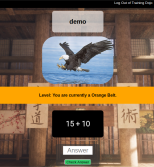

# Math Dojo

Build Status: 

## [The Live Site](http://www.math-dojo.us/math-dojo.html) 

This site was developed for the young children in my extended family; several of my nephews are learning their early mathematics and this is a place where they can practice.  Animals and martial arts appeal to some of the kids.  Hopefully it will serve as a way to keep them engaged and working to develop their skills.  

The project itself was built using JQuery and Node using the Express Router and the Passport JSON Web Token library for authentication.  It uses a Mongo Database at [mLab](https://mlab.com/welcome/) and the [Heroku](heroku.com) platform as a service.  

#
#

